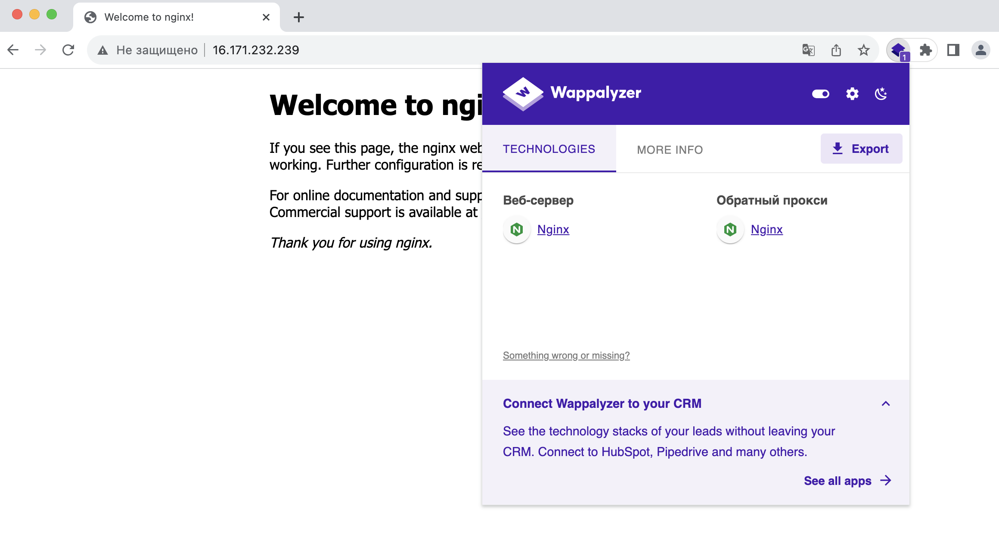

# Extras

[1. Nginx configured as caching reverse proxy](nginx)

[2. Apache configured as caching reverse proxy](apache)

[3. Nginx configured as reverse proxy + Apache as caching reverse proxy](nginx+apache)

[4. Temporary files cleaning cronjob configuration](clean_14d_5mb.md)

##### 5. Wappalyzer: Wordpress installed with helm

##### 6. Wappalyzer: Hide Apache and Nginx Versions
###### NOTE: php in task 6 is omitted due to php version is initially hidden 

 a) Nginx+Nginx (nginx frontend and backend versions are hidden)

 b) Nginx+Apache (apache backend is hidden; due to unknown reason backend apache is shown as nginx)

##### 7. Linux

 a) mount only two loopback devices

 b) mount all loopback devices

##### 8. Jenkins
###### [Jenkinsfile](jenkins/Jenkinsfile)

